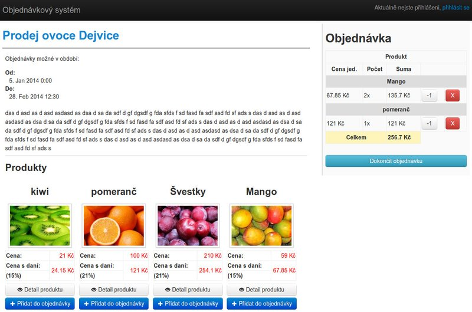
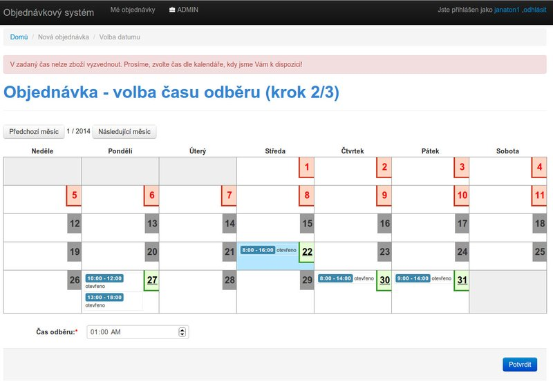
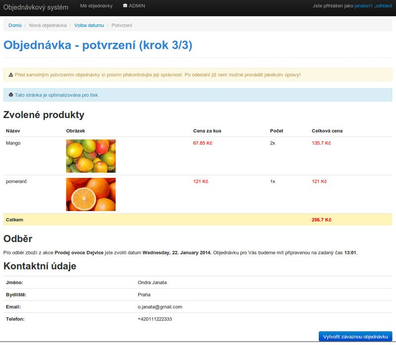
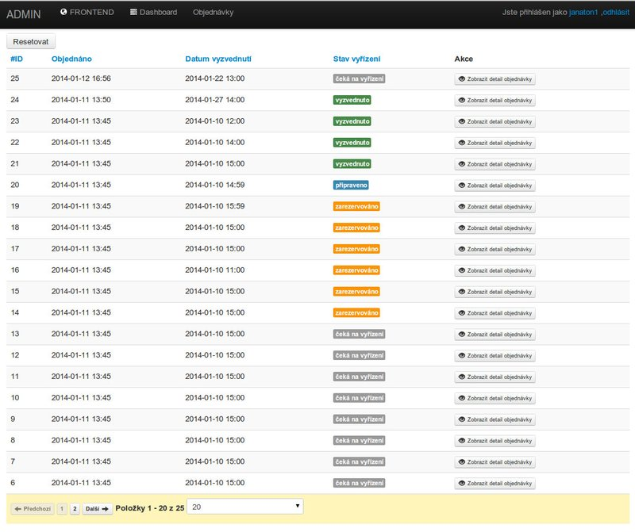
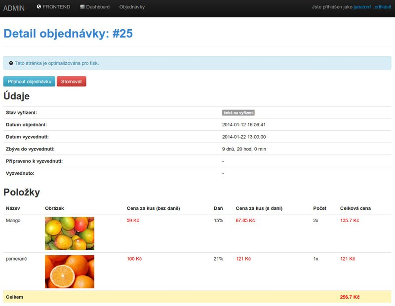
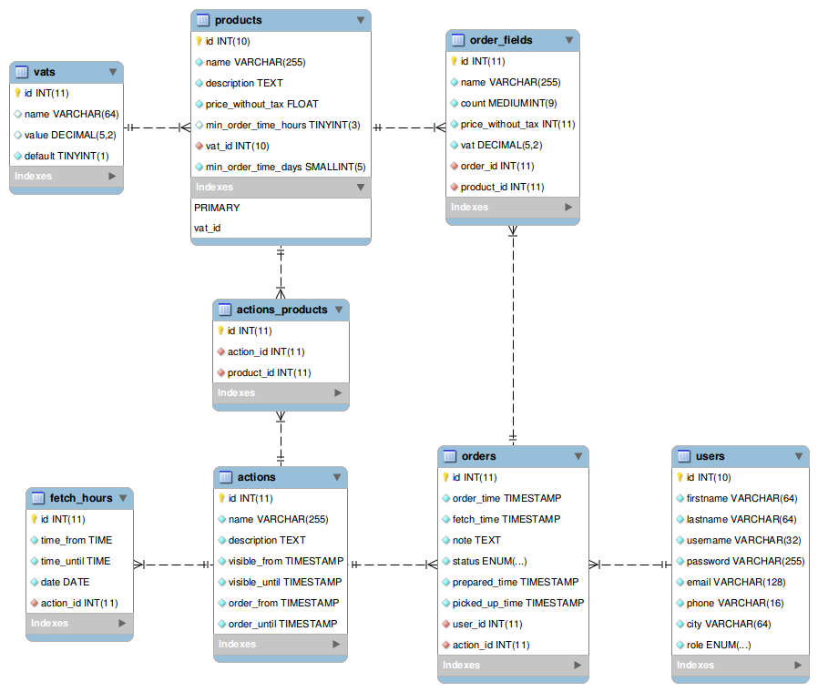

# Jednoduchý webový objednávkový systém
Tento systém vznikl v rámci semestrální práce pro předmět **WA1** na **ČVUT v Praze**. Hlavním smyslem aplikace je
ulehčit práci a ušetřit čas malým podnikatelům, kteří se nechtějí zdržovat telefonickým vyřizováním objednávek svých
zákazníků a svěřit tuto administrativní činnost automatizovanému systému.

Aplikace dovoluje _provozovateli_ naspecifikovat prodejní akce (v případě více prodejních míst) a k nim přiřadit nabízené
produkty. U produktu je možnost určit následující:

* název
* cenu
* dph
* popis
* obrázek
* přibližnou dobu dodání / výroby

U akce můžeme nastavit:

* název
* popis
* čas, po který bude akce zobrazena zákazníkům
* čas, v který bude možné přidávat objednávky

Zákazník, který navštíví aplikaci a rozhodne se objednat zboží, postupně přidá jednotlivé produkty v požadovaném množství.
Obsah objednávky je přehledně zobrazen po pravé straně, včetně kalkulace celkové ceny. Po dokončení výběru zboží je
zákazníkovi zobrazen kalendář s vyznačenými termíny, kdy je možné zboží odebrat. Zákazník si zvolí termín a vloží
plánovaný čas odběru. Poté je zákazníkovi zobrazen souhrn celé objednávky. Po potvrzení objednávky je zákazník
přesměrován na stránku s výpisem všech realizovaných objednávek, kde také následně sleduje vývoj zpracování. Změny
stavů provádí samozřejmě provozovatel systému z administrace na základě reálné situace.

## Licence
Aplikace vznikla pro vlastní potřebu, což není důvodem nepodělit se o ni s ostatními. Doufám, že ji někdo dále využije
a o případné modifikace se dále podělí. Dílo je poskytováno pod **licencí MIT**.

## Případy užití

### Nepřihlášený uživatel

* Přihlášení do systému
* Registrace do systému
* Zobrazení seznamu produktů
* Zobrazení detailu produktu

### Registrovaný uživatel
Přísluší mu **UC** pro _Nepřihlášený uživatel_ a nadále je rozšiřuje o následující.

* Odhlášení ze systému
* Přidání produktu do objednávky
* Odstranění produktu z objednávky
* Zrušení objednávky
* Vyplnění detailních údajů objednávky
    * Poznámka
    * Čas a datum odběru
* Odeslání objednávky
* Zobrazení detailu objednávky (storno možné pouze přes provozovatele)
    * Stav vyřízení
    * Seznam objednaných produktů
* Zobrazení seznamu objednávek

### Administrátor
Přísluší mu **UC** pro _nepřihlášený uživatel, registrovaný uživatel_ a nadále je rozšiřuje o následující.
**Produkt a objednávka** jsou použity pro kategorizaci **UC**.
Obsluha dalších entit se prozatím provádí skrze phpMyAdmin. Do budoucna plánováno doplnění
funkcionality pro správu veškerých entit.

* Produkt
    * Zobrazení výpisu
    * Filtrování produktů
* Objednávka
    * Zobrazení výpisu
    * Filtrování objednávek
    * Změna stavu objednávky (nové, přijato, připraveno, odebráno, zrušeno)

### Náhledy
Následující obrázek zobrazuje 2. krok objednávky, tedy volbu času odběru.

Na dalším obrázku vidíme 3. závěrečný krok objednávky. Jde o souhrn, který slouží pro kontrolu před samotným potvrzení.

Další obrázek zachycuje důležitou stránku administrace, samotný výpis objednávek. Objednávky je možné řadit dle
libovolného sloupce. Pro výkon je implementováno stránkování.

Na následující stránku se dostaneme kliknutím na _"zobrazit detail objednávky"_. Stránka zobrazuje souhrn objednávky a
zároveň disponuje akcemi pro změnu stavu objednávky.

## E-R model

## Budoucí rozšíření
V aktuálním stavu, je aplikace plně využitelná pro svůj účel. Frontend je poměrně dobře zpracován a odladěn. Ovšem
administraci systému je v aktuálním stádiu nutné dělat přímo v databázi. Do budoucna je naplánováno spousta dodělávek.
Zejména se jedná o dopsání administrace pro všechny entity. Dále je plánu rozšíření funkcionality o možnost přidat
výrobkům varianty a přidat další logiku na přijímáni objednávek (limitace počtu na osobu, množstevní slevy ..). Dále již
pro přehlednost v bodech:

* Dopsat administraci zbylých entit (akce, produkty, daňe, otevírací hodiny, uživatelé)
* Přechod na Twitter Bootstrap v3
* Přidat možnosti specifikace variant produktu
    * možná změna ceny
    * možná změna doby dodání
* Přidat CAPTCHA k registraci uživatelů
* Přidat zasílání informačních emailů při vytvoření či změně stavu objednávky

## Instalační manuál
Instalační manuál bude doplněn v blízké době.